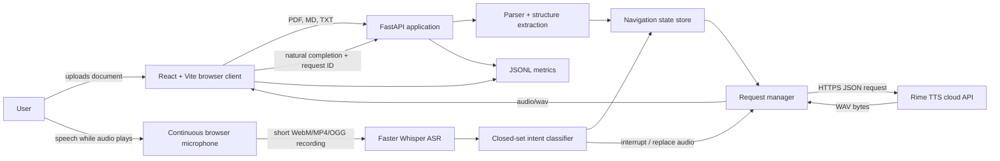

# Narrative.

Narrative is a voice-navigable document reader designed for blind and visually impaired users. It reads PDF, Markdown, and plain-text documents with Rime TTS while maintaining a navigable section and sentence position. The browser keeps listening during playback so a user can interrupt with commands such as "pause," "repeat," "next section," "slow down," or "read the numbers."

## Submission Documents

- Recorded demo: **to be added**
- Reproducible demo fixture: [`demo/acceptance_fixture.md`](demo/acceptance_fixture.md)
- Claim and acceptance evidence: [`RIME_EVIDENCE.md`](RIME_EVIDENCE.md)

## Project Workflow

- Upload and display PDF, Markdown, and .txt documents.
- Detect sections and nested subsections from PDF typography and numbering.
- Read one sentence at a time with boundary-aware pauses and next-sentence prefetching.
- Navigate by section or sentence while preserving stable document position IDs.
- Keep microphone listening active during playback and stop browser audio as soon as speech is detected.
- Transcribe short commands locally with Faster Whisper and map them to a closed command grammar.
- Reject stale TTS responses and stale browser completion events after an interruption.
- Synchronize the reading map and active sentence with playback.
- Record TTS, interruption, recognition, and state-correctness metrics as JSONL.

Supported voice intents are: start/resume, pause, stop, next/previous section, next/previous sentence, skip, repeat, slow down, speed up, and read numbers.

## Architecture



The navigation state store is the single source of truth for the current document, section, sentence, speed, completion state, and last spoken sentence. Every generated clip has a request ID. When a command changes the state, the request manager cancels or invalidates older work; the browser also discards audio and completion messages whose IDs are no longer current.

## Rime configuration used

| Setting | Value |
| --- | --- |
| Provider | Rime |
| Endpoint | `https://users.rime.ai/v1/rime-tts` |
| Model ID | `coda` |
| Speaker | `lyra` |
| Language | English (`en`) |
| Request transport | HTTPS `POST` with JSON body and bearer-token authorization |
| Requested response | `Accept: audio/wav` |
| Browser delivery | FastAPI `StreamingResponse` with media type `audio/wav`; the client receives a Blob and plays it with `HTMLAudioElement` |
| Segmentation | One normalized sentence per synthesis request |
| Speed | `speedAlpha`, initially `1.0`, adjustable from `0.5` to `2.0` |

## Third-party components

- **Rime TTS:** cloud speech synthesis. A Rime API key and network access are required.
- **Faster Whisper:** local speech-to-text for short commands. The configured model is downloaded on first use if it is not already cached.
- **PyMuPDF:** PDF text, font, coordinate, page, and heading extraction.
- **FastAPI, Uvicorn, and HTTPX:** backend API and Rime HTTP integration.
- **React and Vite:** browser interface and development proxy.

## Local setup

### Requirements

- Python 3.11 or newer
- Node.js 20 or newer with npm
- A Rime API key
- A Chromium-based browser with microphone permission
- Internet access for Rime and the first Faster Whisper model download

### 1. Install the backend

From the repository root:

```powershell
python -m venv .venv
.\.venv\Scripts\Activate.ps1
python -m pip install --upgrade pip
pip install -e ".[asr,test]"
```

In Windows Command Prompt, activate with:

```cmd
.venv\Scripts\activate.bat
```

### 2. Configure environment variables

Copy the placeholder file and edit only the new local `.env` file:

```powershell
Copy-Item backend\.env.example
```

```dotenv
RIME_API_KEY=replace-with-your-key
RIME_API_URL=https://users.rime.ai/v1/rime-tts
RIME_MODEL_ID=coda
RIME_VOICE=lyra
RIME_LANGUAGE=en

WHISPER_MODEL_SIZE=base.en
WHISPER_DEVICE=cpu
WHISPER_COMPUTE_TYPE=int8
WHISPER_LANGUAGE=en
```

### 3. Start the backend

```powershell
uvicorn backend.main:app --reload
```

The API runs at `http://127.0.0.1:8000`; interactive API documentation is available at `http://127.0.0.1:8000/docs`.

### 4. Start the frontend

In a second terminal:

```powershell
cd frontend
npm ci
npm run dev
```

Open `http://127.0.0.1:5173`, upload a document, allow microphone access, and say "start reading."

## Testing

Run the automated backend suite:

```powershell
pytest -q
```

Build the frontend:

```powershell
npm --prefix frontend run build
```

Analyze a labeled manual metrics run:

```powershell
python analyze_metrics.py logs/metrics.jsonl
```

The exact full-duplex procedure and browser-console labeling snippet are in [`RIME_EVIDENCE.md`](RIME_EVIDENCE.md).

## API summary

- `POST /documents/upload` - parse and initialize a PDF, Markdown, or text document.
- `GET /documents/{document_id}` - retrieve the structured document map.
- `POST /command` - submit a typed command.
- `POST /command/voice` - transcribe and execute a recorded voice command.
- `GET /playback/state` and `GET /playback/current` - inspect navigation and current content.
- `POST /playback/start|pause|resume|stop` - fallback playback controls.
- `GET /playback/audio` - retrieve the current WAV clip.
- `POST /playback/complete` - confirm that the browser genuinely finished the current clip.
- `POST /metrics/audio-started` and `POST /metrics/event` - record client-confirmed timing and correctness evidence.

## Failure behavior

- Setup, audio, and speech-recognition errors are shown to the user.
- Empty, unreadable, or unsupported files are rejected.
- Unrecognized speech does not change the reading position.
- A valid command stops the current audio before applying the requested action.
- Old audio cannot overwrite a newer command or move the document forward.
- If microphone access is denied, the on-screen controls remain available.
- After the final sentence, the reader returns to the beginning.

## Known limitations

- Scanned PDFs are unsupported because OCR is not included.
- Complex tables, equations, and unusual PDF layouts may be read imperfectly.
- PDF highlighting appears in the reading map, not directly over the PDF page.
- Voice recognition supports short English commands, not dictation or open-ended questions.
- The first voice command may be slower while the speech-recognition model loads.
- Hindi, multilingual, and code-mixed content (e.g., Hinglish) is not currently supported.

## Repository map

```text
.
├── analyze_metrics.py          # Metrics analysis report
├── pyproject.toml              # Python package and test configuration
├── requirements.txt            # Python dependencies
├── RIME_EVIDENCE.md            # Acceptance evidence and demo procedure
├── demo/
│   └── acceptance_fixture.md   # Reproducible demo document
├── backend/
│   ├── main.py                 # FastAPI application
│   ├── service.py              # Application service wiring
│   ├── api/                    # HTTP route handlers
│   ├── document/               # Parsing, structure, and normalization
│   ├── models/                 # API and domain models
│   ├── navigation/             # Reading state and navigation transitions
│   ├── playback/               # Playback lifecycle management
│   ├── tts/                    # Rime client and request management
│   ├── voice/                  # Speech recognition and intent matching
│   └── tests/                  # Backend unit and integration tests
├── frontend/
│   ├── src/                    # React reader interface
│   ├── index.html
│   └── package.json
└── logs/
    └── metrics.jsonl           # Runtime metrics output
```


